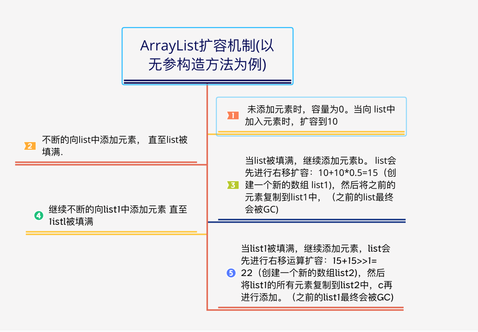

### List视频文案
- [ArrayList源码](/Code-Video/src/main/java/com/video/javaOutline/conllection/list/ArrayList.java)

1、add 第 1 个元素的时候，
数组还为空，
数组容量会扩容到默认容量10

2、add 第 2 到 10 个元素的时候：
elementData长度经过第一次扩容已经变成了10
所以不会走扩容

3、add第11个元素的时候，
进入扩容
经过右移1运算等于15，
是原来数组容量的1.5倍
以此类推

### 相关图片

