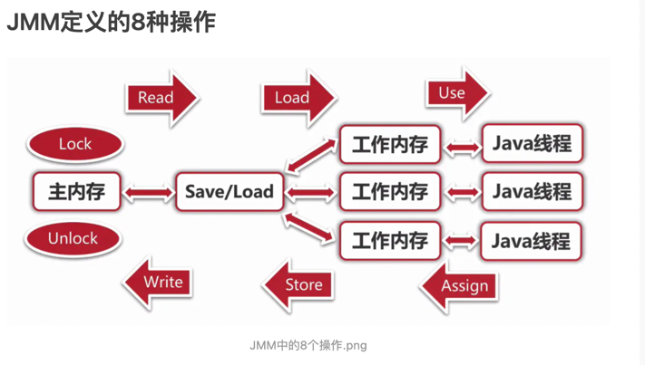

## 东西有点杂乱，没有整理，大家将就看看

### java-security（java安全加密合集）

#### JAVA进制转换 com.security.jinzhi

#### JAVA安全实现三种方式：

    1.JDK 2.Commons Codec 3.Bouncy Castle

##### 一。非对称加密算法：com.security.asymmetric_encryption

    1.DH 2.RSA 3.ElGamal

##### 二。Base64：com.security.base64

    1.JDK实现 2.common codes实现 3.bouncy castle实现

##### 三。消息摘要算法：com.security.message_digest

    1.MD5 2.SHA 3.MAC

##### 四。数字签名:JDK实现 com.security.signature

    1.RSA 2.DSA 3.ECDSA

##### 五。对称加密算法：com.security.symmetric_encryption

    1.3DES 2.AES 3.PBE

##### 六。PBKDF2 密码加密验证 :com.security.password_hash
    1.PBKDF2&SHA256 2.PBKDF2WithHmacSHA256

##### 七。AES+RSA签名，加密 验签，解密（用户客户端服务端验证）: com.security.interface_verification_design

- 客户端密钥利用参数内容生成RSA签名、随机数生成AES密钥对参数进行加密、利用服务端公钥对AES密钥进行RSA加密
- RSA服务端私钥对AES密钥进行解密、利用AES密钥解开请求参数、服务端公钥RSA对请求参数进行验证签名

### Spring合集
#### bean生命周期

### Java内存模型

#### JMM定义的同步规则
- 如果要把一个变量从主内存中复制到工作内存，就需要按顺序的执行read和load操作；如果把变量从工作内存中同步回主内存中，就需要按顺序的执行store和write操作；但JMM只要求上述操作必须按顺序执行，而没有保证必须是连续执行；
- 不允许read和load，store和write操作之一单独出现；
- 不允许一个线程丢弃它的最近assign的操作 ，即变量在工作内存中改变了之后必须同步回主内存；
- 不允许一个线程无原因的（没有发生任何assign操作）把数据从工作内存同步回主内存中；
- 一个新的变量只能在主内存中诞生，不允许在工作内存中直接使用一个未被初始化（load或assign）的变量；即就是对一个变量实施use和store前，必须先执行了assign和load操作；
- 一个变量在同一时刻只允许一条线程对其进行lock操作，但lock操作可以被同一条线程重复执行多次，多次执行lock后，之后执行相同次数的unlock操作，变量才会被解锁；lock和unlock必须成对出现；
- 如果对一个变量执行lock操作，将会清空工作内存中此变量的值，在执行引擎使用这个变量前需要重新执行load或assign操作初始化变量的值；
- 如果一个变量事先没有被lock操作锁定，则不允许对它执行unlock操作，也不允许去unlock一个被其他线程lock的变量；
- 对一个变量执行unlock操作之前，必须先把此变量同步到主内存中（执行store和write操作）；
