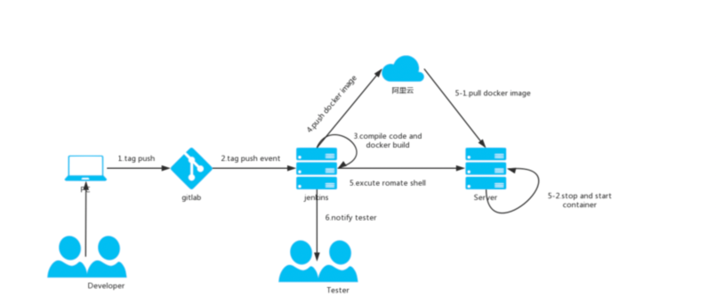

基于Jenkins，docker实现自动化部署

1、开发人员在gitLab上打了一个tag
2、gitLab把tag事件推送到Jenkins
3、Jenkins 获取tag源码，编译，打包，构建镜像
4、Jenkins push 镜像到阿里云仓库
5、Jenkins 执行远程脚本
5-1. 远程服务器 pull 指定镜像
5-2. 停止老版本容器，启动新版本容器
#### 本文主要介绍使用docker maven插件制作springboot镜像


***因为使用M1电脑中间遇到了很多问题,下面会记录遇到的问题***

- maven 构建镜像配置

pom.xml 文件添加docker插件<br>
***一开始使用com.spotify插件,会出现下面现象***
-----
  错误：

引起原因：com.spotify.docker.client.shaded.javax.ws.rs.ProcessingException：java.lang.UnsatisfiedLinkError：无法加载 FFI 提供程序 jnr.ffi.provider.jffi.Provider

引起：java.lang.UnsatisfiedLinkError：java.lang.UnsatisfiedLinkError：/private/var/folders/hz/rgppp8250rsdp86kf_tfjvqw0000gp/T/jffi8502916075702391528.dylib：dlopen(/private/var/folders/hz/rgppp8250rs dp86kf_tfjvqw0000gp/T/jffi8502916075702391528.dylib ，0x0001）：尝试：'/private/var/folders/hz/hz/rgppp8250rsdp86kf_tf_tfjvqw0000gp/t/jffi850291602916075702391528.dylib' /lib/jffi8502916075702391528.dylib'（没有这样的文件）

---
参考:https://stackoverflow.com/questions/71300031/docker-image-build-failed-on-mac-m1-chip  <br>
另外com.spotify插件已经不再维护了
后来使用io.fabric8 maven插件
但是低版本已经会出现这个问题
使用最新的0.43.4解决了这个问题
```
<build>
        <plugins>
            <plugin>
                <groupId>io.fabric8</groupId>
                <artifactId>docker-maven-plugin</artifactId>
                <version>0.43.4</version>
                <configuration>
                    <dockerHost>unix:///Users/mac_1/.docker/run/docker.sock</dockerHost>
                    <registry>${registry.host}</registry>
                    <authConfig>
                        <username>${registry.username}</username>
                        <password>${registry.password}</password>
                    </authConfig>
                    <images>
                        <image>
                            <name>${registry.host.name}/${docker.project.build.finalName}:${buildVersion}</name>
                            <registry>${registry.host}</registry>
                            <build>
                                <dockerFile>${project.basedir}/Dockerfile</dockerFile>
                            </build>
                        </image>
                    </images>
                </configuration>
            </plugin>
        </plugins>
    </build>
```

- 添加dockerfile文件

再pom同级目录添加dockerfile文件

```
# 基础镜像
FROM java:8
# 作者信息
MAINTAINER "DS"
# 添加一个存储空间
VOLUME /tmp
# 暴露8080端口
EXPOSE 8080
ARG JAR_FILE=target/spring-boot-docker.jar
# 往容器中添加jar包
ADD ${JAR_FILE} app.jar

# 启动镜像自动运行程序
ENTRYPOINT ["java","-Djava.security.egd=file:/dev/urandom","-jar","/app.jar"]
```
之后执行
mvn package (打jar包)<br>
docker build (制作镜像)<br>
docker pull (推镜像到私有仓库)<br>

***其中<registry>${registry.host}</registry>中的registry.host
是使用docker-registry ,官方提供的工具，可以用于构建私有的镜像仓库。
```
docker run -d  -p 5000:5000 -v /Users/mac_1/data/docker/registry:/var/lib/registry  registry
```

docker-registry参考文档:https://yeasy.gitbook.io/docker_practice/repository/registry
